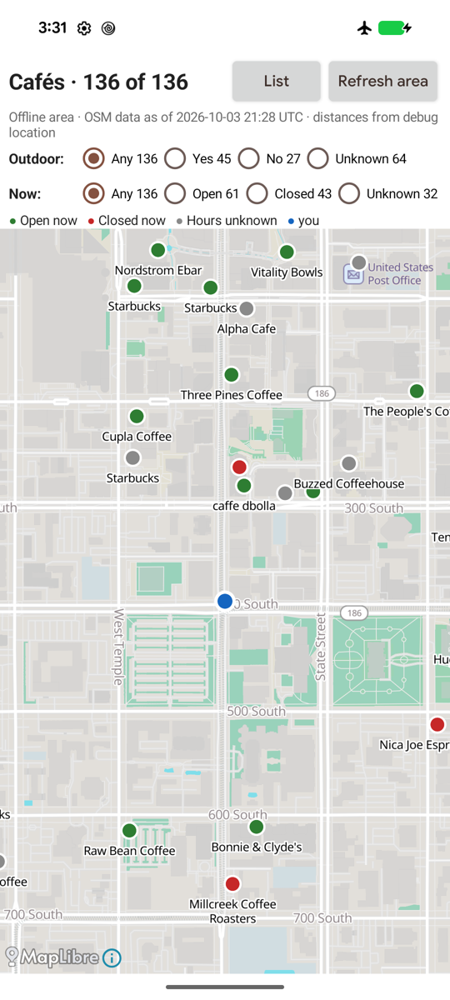
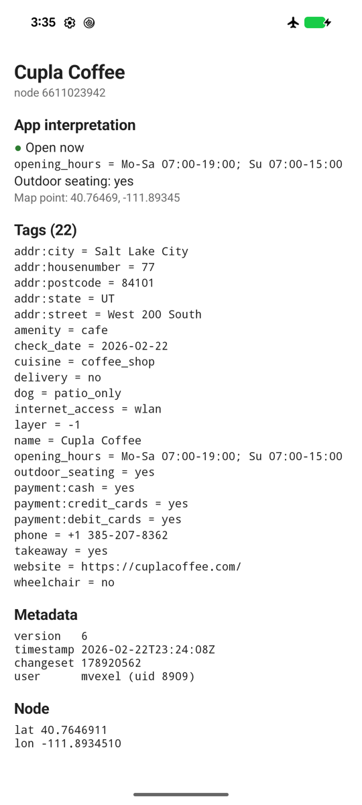

# Cantino

**Cantino — an offline OpenStreetMap data SDK for Android and iOS apps.**

Cantino aims to give mobile developers composable, supported building blocks
for apps that work with OpenStreetMap data offline: showing an offline map,
finding and inspecting features, and, eventually, apps that edit. Today it
provides the read side.

Cantino gives your app an immutable snapshot of raw OpenStreetMap data for
an area you choose. Download it once online, then look up objects by ID and
query their tags and bounding boxes without a network connection. A shared
Rust core stores the snapshot in a local SQLite file.

The managed download flow fetches an extract from
[SliceOSM](https://slice.openstreetmap.us/), imports it, and publishes it with
crash recovery. You can also import a local OSM PBF or XML snapshot. An
optional, separate [PMTiles](https://docs.protomaps.com/pmtiles/) basemap
covers the same bounding box and can be rendered with
[MapLibre Native](https://maplibre.org/).

*In 1502 Alberto Cantino smuggled a copy of Portugal's secret master map out
of Lisbon: a copy of the master map you carry away.*

<p>
  
  
</p>

*The café reference app ([`android/cafe-app`](android/cafe-app)) in airplane
mode: offline basemap, cafés from a tag + bbox query, and the raw object.*

## Capabilities

| Capability | Status |
| --- | --- |
| Snapshot store and queries (lookup, tags, bbox candidates) | Available, Android and iOS |
| Area acquisition (download, import, refresh, crash-safe publication) | Available, Android and iOS |
| Basemap acquisition (PMTiles file or on-device extract), with an area | Available, Android and iOS |
| Basemap-only acquisition (a map without the OSM data) | Planned next |
| Editing (local edit layer over a snapshot) | Outside the current implementation; see [Editing apps](docs/guide/editing-apps.md) |
| Upload to the OSM API | Not planned |

The capabilities ship together as one library per platform; they are
separate layers in the code (see [Concepts](docs/guide/concepts.md#capabilities))
and may become separate build options when an app needs that.

## What Cantino is

Cantino is a **local raw-data component** for apps that need to inspect or
query OSM objects offline in a bounded area: a field reference app, a POI
explorer, or a raw-data feature alongside an existing map engine. Your app
owns the user interface, interpretation of tags, and any editing or
navigation behavior.

- **A read-only snapshot store:** raw tags, ordered way nodes, relation
  members and roles, and object metadata. Untagged-node metadata is optional.
- **A query API:** lookup by typed OSM ID, ANDed tag filters, bounding-box
  spatial candidates, keyset pagination, and missing-reference reporting.
- **An area download lifecycle:** progress, retries, cancellation, staged
  import, and journaled publication. Refresh replaces the whole snapshot;
  an already-open store continues to read its old snapshot.
- **Optional import profiles:** retain matching objects and their available
  dependencies. Filtering reduces local storage; the managed flow still
  downloads the full extract.
- **An optional basemap companion:** download a ready PMTiles file or extract
  one from a remote archive. Apps can use their existing renderer and omit
  this part entirely. The raw data and basemap have independent sources and
  may represent different OSM snapshot times.

## What Cantino is not

These describe the current implementation, not a list of promised future
features.

- **An OSM editing or synchronization framework (outside the current
  implementation).** There is no mutable object graph, pending-edits layer,
  undo, upload, or conflict resolution. An editor owns those systems and
  uses the snapshot as base data; see
  [Editing apps](docs/guide/editing-apps.md).
- **A complete offline map or navigation engine.** Cantino does not render
  maps, generate vector tiles, route, geocode, or provide address search.
  It is not a replacement for the specialized engines in apps such as
  OsmAnd or CoMaps.
- **A complete OSM graph or exact geometry engine.** Extracts can omit nodes
  and relation members beyond their boundary. Bounding-box queries return
  candidates, not exact intersections; missing geometry can also cause
  objects to be missed. Reference reporting does not establish that all
  parent ways or relations are present. Multipolygon assembly is outside
  the scope.
- **A country-scale or continuously updated data platform.** The supported
  use case is one bounded area per app. Overlapping-area reconciliation,
  incremental updates, and country-scale operation are outside the scope.
- **A hosted-service guarantee.** Initial downloads and refreshes need a
  network connection. Production apps must plan their extract and basemap
  hosting, capacity, and privacy requirements; see
  [SliceOSM in production](docs/guide/sliceosm.md) and
  [Basemap hosting](docs/guide/basemaps.md#hosting-demo-vs-production).

## Platform and release status

Android provides the complete reference flow through WorkManager and the
café app (`arm64-v8a`, `x86_64`; minSdk 26). On iOS (15+), the Swift package
provides the same store API and area downloads (URLSession, in the app's
process; an interrupted download resumes at the next launch), tested on the
simulator and against the same cross-platform test corpus as Android. The
iOS café demo is being built. See the [Swift adapter](swift/README.md) and
[roadmap](docs/guide/roadmap.md). New features are paused until iOS and
Android are at parity and the iOS café demo works.

Cantino is in development and has no external consumers yet. API, ABI, and
file formats may change without backward compatibility; adopting it today
means budgeting for integration changes and re-importing development data.

## Install

Development artifacts use a static Maven repository on GitHub Pages.
For the current checkout, [build and publish locally](docs/guide/building.md);
the API below may differ from previously published artifacts.

```kotlin
// settings.gradle.kts
dependencyResolutionManagement {
    repositories {
        google()
        mavenCentral()
        maven { url = uri("https://mvexel.github.io/cantino/maven") }
    }
}
```

```kotlin
// app/build.gradle.kts
android {
    defaultConfig {
        minSdk = 26
        // Cantino ships native code for these two ABIs only (phones and x86_64 emulators).
        ndk { abiFilters += listOf("arm64-v8a", "x86_64") }
    }
}

dependencies {
    implementation("lol.osm:cantino:0.4.0")
    // Only to show the offline basemap.
    implementation("org.maplibre.gl:android-sdk:13.6.1")
}
```

The library adds `INTERNET` and `ACCESS_NETWORK_STATE` to your manifest
(WorkManager adds its own). Nothing else is required; long downloads can opt
into a [foreground service](docs/guide/downloading.md#foreground-mode).

**iOS:** no published package yet. Build the core with
`scripts/build-xcframework.sh` (macOS, Xcode, Rust; see
[Building](docs/guide/building.md)) and add [`swift/`](swift) as a local
Swift package; the [Swift adapter README](swift/README.md) has the API and
an example.

## Quickstart

Download a ~10×10 km area once, list its cafés offline, show the basemap.
A complete activity (no layout file needed):

```kotlin
// app/src/main/java/com/example/cafes/MainActivity.kt
package com.example.cafes

import android.app.Activity
import android.os.Bundle
import android.util.Log
import lol.osm.cantino.*
import kotlinx.coroutines.*
import kotlinx.coroutines.flow.*
import org.maplibre.android.MapLibre
import org.maplibre.android.camera.CameraPosition
import org.maplibre.android.geometry.LatLng
import org.maplibre.android.maps.MapView
import org.maplibre.android.maps.Style

class MainActivity : Activity() {
    private val scope = MainScope()
    private lateinit var mapView: MapView
    private val lat = 40.7608 // use the user's location
    private val lon = -111.8910

    override fun onCreate(savedInstanceState: Bundle?) {
        super.onCreate(savedInstanceState)
        MapLibre.getInstance(this)
        mapView = MapView(this).also { setContentView(it); it.onCreate(savedInstanceState) }
        scope.launch {
            val area = publishedOrDownload()
            // An OsmStore belongs to the thread that opened it: open, query and close in one block.
            val cafes = withContext(Dispatchers.IO) {
                OsmStore.open(area.dataFile).use { store ->
                    store.query(Query(tags = listOf(TagFilter.Equals("amenity", "cafe")), limit = 1000))
                }
            }
            Log.i(TAG, "${cafes.size} cafés, e.g. ${cafes.firstOrNull()?.tags?.get("name")}")
            showBasemap(area)
        }
    }

    /** The published area, or a fresh download of ~10×10 km around (lat, lon). */
    private suspend fun publishedOrDownload(): AreaInfo {
        val areas = AreaManager(this)
        areas.loadPublishedArea(AREA)?.let { return it }
        val bbox = Bbox.around(lat, lon, widthKm = 10.0)
        val runId = areas.download(AREA, bbox, basemap = BasemapSource.Extract(latestDemoBasemap(), maxZoom = 15))
        // state() follows the area, not one run: match runId to wait for *this* download.
        val end = areas.state(AREA)
            .onEach { Log.i(TAG, "$it") } // Queued, Submitting, Slicing, Downloading, Importing, Basemap, Ready
            .first { it.runId == runId && it.isTerminal }
        return (end as? AreaState.Ready)?.area ?: error("download ended: $end")
    }

    // Demo only: production apps supply a URL they host (with HTTP range support).
    private suspend fun latestDemoBasemap(): String = withContext(Dispatchers.IO) {
        val today = java.time.LocalDate.now(java.time.ZoneOffset.UTC)
        for (age in 0L..7L) {
            val date = today.minusDays(age).format(java.time.format.DateTimeFormatter.BASIC_ISO_DATE)
            val url = "https://build.protomaps.com/$date.pmtiles"
            val connection = java.net.URL(url).openConnection() as java.net.HttpURLConnection
            try {
                connection.requestMethod = "HEAD"
                connection.connectTimeout = 15_000
                connection.readTimeout = 15_000
                when (val status = connection.responseCode) {
                    200 -> return@withContext url
                    404 -> Unit
                    else -> throw java.io.IOException("Basemap lookup failed: HTTP $status")
                }
            } finally {
                connection.disconnect()
            }
        }
        throw java.io.IOException("No recent demo basemap found")
    }

    private fun showBasemap(area: AreaInfo) = mapView.getMapAsync { map ->
        map.cameraPosition = CameraPosition.Builder().target(LatLng(lat, lon)).zoom(13.0).build()
        map.setStyle(Style.Builder().fromJson("""{"version": 8,
            "sources": {"osm": {"type": "vector", "url": "${area.pmtilesUrl}",
                                "attribution": "© OpenStreetMap contributors, Protomaps"}},
            "layers": [
              {"id": "earth", "type": "fill", "source": "osm", "source-layer": "earth", "paint": {"fill-color": "#f2efe9"}},
              {"id": "water", "type": "fill", "source": "osm", "source-layer": "water", "filter": ["==", "${'$'}type", "Polygon"],
               "paint": {"fill-color": "#a6cbe3"}},
              {"id": "roads", "type": "line", "source": "osm", "source-layer": "roads", "paint": {"line-color": "#9e9e9e"}}]}"""))
    }

    override fun onStart() { super.onStart(); mapView.onStart() }
    override fun onResume() { super.onResume(); mapView.onResume() }
    override fun onPause() { mapView.onPause(); super.onPause() }
    override fun onStop() { mapView.onStop(); super.onStop() }
    override fun onDestroy() { scope.cancel(); mapView.onDestroy(); super.onDestroy() }

    private companion object {
        const val TAG = "Cantino"
        const val AREA = "city" // your name for the area: 1-64 of [A-Za-z0-9_-]
    }
}
```

Run it once online (about 30 s for 10×10 km of a city), then again in airplane
mode: the cafés and the map come from the device. The three-layer style keeps
the example self-contained; for labels and the full Protomaps look, see
[Basemaps](docs/guide/basemaps.md#a-full-offline-style).

Things the quickstart glosses over, each covered in the guide: showing
progress and failures to the user, refreshing an area, keeping one long-lived
store on its own thread, paging through large results, and the privacy note
(the bbox is sent to SliceOSM and the basemap host).

## Documentation

- **[Guide](docs/guide/README.md)**: concepts, downloading areas, basemaps,
  querying, performance, building from source, the C ABI, and a walkthrough
  of the café app. Also on the site: <https://mvexel.github.io/cantino/guide/>.
  Production topics: [SliceOSM in production](docs/guide/sliceosm.md),
  [opening hours](docs/guide/opening-hours.md),
  [editing apps](docs/guide/editing-apps.md) and the
  [roadmap and maintenance](docs/guide/roadmap.md).
- **[API reference](https://mvexel.github.io/cantino/api/)** (Dokka; generate
  locally with `cd android && ./gradlew :cantino:dokkaGeneratePublicationHtml`).
- **Samples**: [`android/cafe-app`](android/cafe-app) (the full offline flow:
  first-run download, map, filters, raw object inspector) and
  [`android/sample-app`](android/sample-app) (a bundled PMTiles basemap in
  MapLibre, no network at all). The iOS café app is in progress.
- **[Swift adapter](swift/README.md)**: the iOS/macOS API and how it differs
  from Kotlin.
- **[CHANGELOG](CHANGELOG.md)**, development history.

## License and attribution

Cantino is licensed under the [Apache License 2.0](LICENSE) ([NOTICE](NOTICE)).

The data is not. OpenStreetMap data is © OpenStreetMap contributors and
available under the [Open Database License](https://www.openstreetmap.org/copyright)
(ODbL). **An app that shows OpenStreetMap data, or a basemap made from it, must
show "© OpenStreetMap contributors"** (and credit Protomaps when it uses a
Protomaps basemap build); see the [OSMF attribution
guidelines](https://osmfoundation.org/wiki/Licence/Attribution_Guidelines).
MapLibre shows the `attribution` of your style's sources; an app with its own
UI must show it itself.

"OpenStreetMap" is used here only to describe the data Cantino works with.
Cantino is not affiliated with or endorsed by the OpenStreetMap Foundation.
