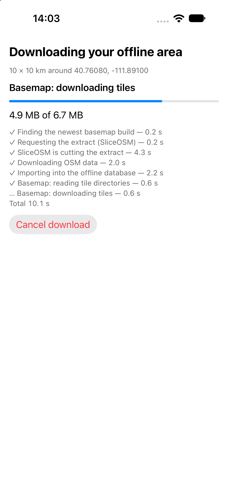
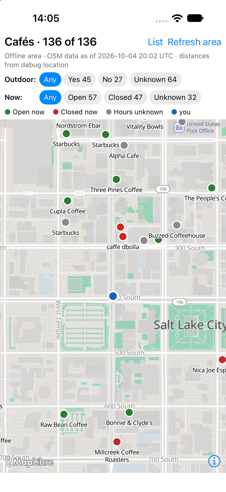
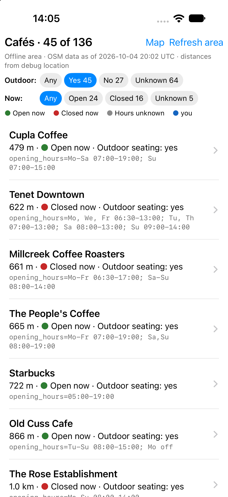
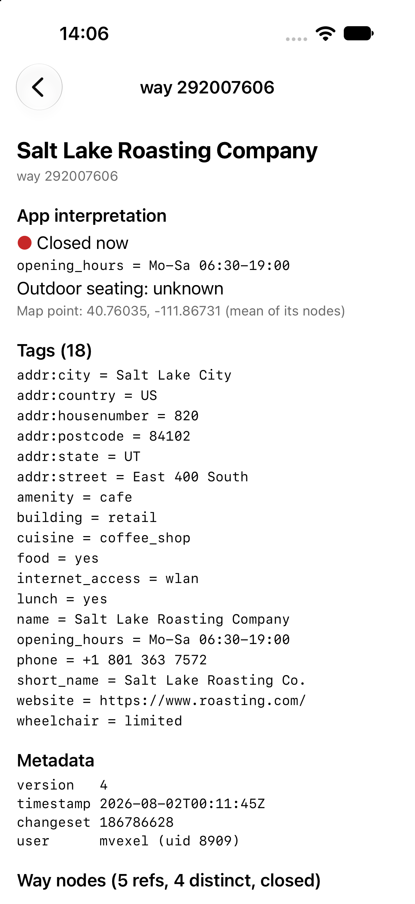

# Café app walkthrough

[`android/cafe-app`](../../android/cafe-app) is the reference app for
Cantino: find cafés near you, with no network after the first
download. Plain Android views, MapLibre Native 13.6.1, no Play Services.
It passed this acceptance scenario on a Pixel 8 (2026-10-03, downtown Salt
Lake City):

| Download | Map, airplane mode | Filters | Object detail |
| --- | --- | --- | --- |
|  |  |  |  |

Paths below are relative to `android/cafe-app/src/main/java/lol/osm/cantino/cafe/`.

## 1. Download the area

| What | Code | Cantino API |
| --- | --- | --- |
| Location permission, one fix (`LocationManager`, 30 s timeout); fallback: type "lat,lon" or pick a preset | `MainActivity.startFirstRun`, `Location.kt` (`DeviceLocation.current`) | |
| 10×10 km box around the fix | `Cafes.kt`: `Geo.squareAround`, `Geo.AREA_SIZE_KM` (a default, not a cap) | `Bbox` |
| Offer dialog: what is kept (points of interest only) and the privacy line (the bbox goes to SliceOSM and the tile host) | `MainActivity.offerDownload` | |
| Keep only points of interest: one import profile for the app | `Cafes.kt`: `CafeProfile` | `ImportProfile`, `KeepRule`, `AreaManager(context, AreaConfig(importOptions = ImportOptions(profile = …)))` |
| Find a basemap build (demo) and start the download | `MainActivity.startDownload` | Example-local `ProtomapsBuilds.latestUrl()`, `AreaManager.download(…, BasemapSource.Extract(planet, maxZoom = 15))` |
| Progress screen: phase, bytes (with total when known), per-phase durations | `MainActivity.ProgressScreen.update` | `AreaManager.state(areaId)`, every `AreaState` subtype |
| Failure: Retry, or back to the map (the previous area is kept) | `MainActivity.showFailure` | `AreaState.Failed.retryable`, `publishedArea` |
| Refresh: same bbox, full replace | `MainActivity.confirmRefresh` | `AreaMetadata.bbox`, `download` again |

The state is collected for the activity's whole life (`MainActivity.onCreate`),
so a relaunch during a download shows its progress, and the first emitted
state decides the screen: running → progress, published → map, otherwise →
first run.

### Import profile: points of interest only

The app keeps the OSM objects with any of the keys `amenity`, `shop`,
`tourism`, `leisure`, `craft`, `office`, `healthcare` or `historic` (nodes,
ways and relations), the POI profile from
[Downloading](downloading.md#keep-only-what-you-need-import-profiles). The
café app needs only `amenity=cafe` and what those objects reference; the
basemap draws streets, buildings and water. The basemap is not affected by
the profile. Kept ways keep all their nodes and kept relations all their
members, so markers for ways and relations and the inspector's node and member
lists work as with a full import. An object opened directly that is not in
the file may be outside the area *or* filtered out; the inspector names both
causes.

Measured with the profile (2026-10-04, downtown Salt Lake City, live
download): 5.1 MB database instead of 61 MB, 6.5 MB basemap, ready in about
9–10 s on the iOS simulator and the Android emulator, still 136 cafés.
Earlier, with a full import: Ready in 27.4 s, 75.6 MB database, 6.5 MB
basemap on a Pixel 8
([Performance](performance.md#area-download-1010-km)).

Known limit: `AreaMetadata.report.profile` currently reads back as null for a
published area on both platforms (the core's sidecar parser drops it), so the
map's status line cannot show the profile yet; it shows it ("points of
interest only") once the report carries it.

## 2. Restart in airplane mode

Nothing to do in code: on launch, `publishedArea(AREA_ID)` is not null, so
`MainActivity` goes straight to `showMap()`. Every byte the map and queries
need is in `filesDir/cantino-areas/`.

## 3. Show the basemap

| What | Code | Cantino API |
| --- | --- | --- |
| Offline Protomaps style (copied from the sample app's `build-assets` by the `copyBasemapStyleAssets` Gradle task) with the area's PMTiles URL substituted | `MapScreen.styleJson` | `AreaInfo.pmtilesUrl` |
| Keep the camera over the area | `MapScreen.setupMap` | `AreaMetadata.bbox` |

## 4. Find nearby cafés

| What | Code | Cantino API |
| --- | --- | --- |
| One store, one thread, reopened after a refresh | `CafeStore.withStore` | `AsyncOsmStore`, `AreaMetadata.workId` |
| All `amenity=cafe` in the area, paged by 500 | `CafeLoader.load` | `Query(tags, bbox, after, limit)`, `TagFilter.Equals` |
| Status line: snapshot age and the area's recorded import profile | `MapScreen.applyFilters` | `AreaMetadata.snapshotTimestamp`, `report.profile` |
| A map point for ways and relations (an anchor, not exact geometry) | `CafeLoader` marker helper | `wayCoordinates`, batch `get` |
| Dots on the map (GeoJSON source), nearby list sorted by distance | `MapScreen.applyFilters`, `MapScreen.geoJson` | |

Result on the Salt Lake City area: 136 cafés (120 nodes, 16 ways).

## 5. Filter by outdoor seating and opening hours

Interpretation lives in the app, never in Cantino:

| Filter | Code | Rule |
| --- | --- | --- |
| Outdoor seating Yes / No / Unknown | `Cafes.kt`: `OutdoorSeating.of` | `yes`, `no`, seating kinds (`sidewalk`, `garden`, …) = yes; missing or anything else = Unknown (raw value kept) |
| Open now / Closed / Unknown | `OpeningHours.kt` (14 JVM tests in `src/test`) | A strict subset of the `opening_hours` syntax; anything else is Unknown with a reason. Missing tag = Unknown |

Each choice shows its count, and Unknown is never folded into Open or Closed:
on this area 104 of 106 present `opening_hours` values evaluate; 30 cafés have
none.

## 6. Inspect tags and underlying objects

| What | Code | Cantino API |
| --- | --- | --- |
| Any object by kind and ID | `DetailActivity` | `store.get(OsmId)` |
| All raw tags | `DetailActivity.render` | `OsmObject.tags` |
| Metadata, or "not stored (location version N)" for untagged nodes | `DetailActivity.describe` | `ObjectMetadata`, `Node.locationVersion` |
| Way node list in order, repeats included, tap → node | `DetailActivity` | `Way.nodeIds` |
| Relation members (role, kind, id), "not in this area" when missing | `DetailActivity` | `Relation.members`, `get` returning null |
| Object not in the file: "not in this area or filtered out" (both causes, the profile when recorded) | `RelationDetail.kt`: `notFoundText` | `ImportReport.profile` |

## Running it

```sh
scripts/basemap-assets.sh                         # style, glyphs, sprites
scripts/build-android.sh
cd android && mise exec -- ./gradlew :cafe-app:installDebug
# Automated runs: never send a real location; use the debug override (debuggable builds only)
adb shell am start -S -n lol.osm.cantino.cafe/.MainActivity --ef lat 40.7608 --ef lon -111.8910
```

Known limit: opening hours are evaluated in the phone's time zone. This is
correct for the default flow because the area is downloaded around the user,
but wrong when an area is used in another time zone; the area zone is not yet
stored.

## iOS

[`ios/cafe-app`](../../ios/cafe-app) is the same app in SwiftUI with
MapLibre Native 6.31.0 (iOS 17+), feature for feature, on the Swift
adapter. On the iPhone 18 Pro simulator (iOS 27, 2026-10-04, downtown Salt
Lake City) a live download and a refresh each took about 11 s (61 MB
database, 6.5 MB basemap); the map showed 136 cafés (45 / 27 / 64 outdoor
seating yes / no / unknown, 32 with unknown hours), as on Android. With the
POI import profile (`CafeProfile` in `Cafes.swift`, the same rules as on
Android) the same download took 9.3 s and produced a 5.1 MB database, with
the same 136 cafés and counts.

| Download | Map, no network used | Filters | Object detail |
| --- | --- | --- | --- |
|  |  |  |  |

Paths are relative to `ios/cafe-app/CafeApp/`; each file names its Android counterpart.

| Android | iOS | Notes |
| --- | --- | --- |
| `MainActivity` (flow, progress, failure, refresh) | `AppModel.swift`, `FirstRunViews.swift` | The offer is a screen, not a dialog. Refresh downloads the published `AreaMetadata.bbox` itself |
| `Location.kt` (`LocationManager`, debug extras) | `Location.swift` (`CLLocationManager`, one fix, 30 s) | Debug override: launch arguments, see below |
| `CafeStore.kt` (`Mutex`) | `CafeStore.swift` (actor + FIFO gate) | Same reopen-by-`workId` rule; the gate holds select–open–read, since actors are reentrant |
| `Cafes.kt` (`CafeProfile`), `RelationDetail.kt`, `OpeningHours.kt`, `ProtomapsBuilds.kt` | `Cafes.swift` (`CafeProfile`), `OpeningHours.swift`, `ProtomapsBuilds.swift` | Straight ports; relation markers use one batch `get` |
| `MapScreen.kt` (radio groups) | `MapScreen.swift` (chips with counts) | Style copied into the bundle by `copy-basemap-assets.sh` (the `copyBasemapStyleAssets` counterpart); `asset://` resolves to the bundle |
| `DetailActivity` | `DetailView.swift` | Way nodes resolved with one batch `get` |
| JVM + instrumented tests | `CafeAppTests/` (26 Swift Testing tests, hosted on the simulator) | Opening hours (all Kotlin cases), Protomaps builds (URLProtocol stub), relation café (imported with the POI profile), POI profile applied, paging past 500, refresh race |

Airplane mode cannot be switched on for a simulator alone, so the closest
honest check was used: after the download, a cold launch with the map,
filters and inspector open had no internet sockets (`lsof -a -i -p <pid>`
empty), while the same check during a refresh showed the SliceOSM and
tile-host connections. The style references only `asset://` and the
area's `pmtiles://file://` archive.

```sh
scripts/basemap-assets.sh && scripts/build-ios-cafe.sh install
# Debug builds only; never real GPS in automated runs. -lat/-lon is sticky (-clear_debug_location YES).
xcrun simctl launch booted lol.osm.cantino.cafe -lat 40.7608 -lon -111.8910 -auto_download YES
# simctl cannot tap: these stand in for taps (DebugLaunch.swift)
xcrun simctl launch booted lol.osm.cantino.cafe -list YES -outdoor yes -now open
xcrun simctl launch booted lol.osm.cantino.cafe -object way/292007606
xcrun simctl launch booted lol.osm.cantino.cafe -refresh YES [-cancel_after 4]
```
