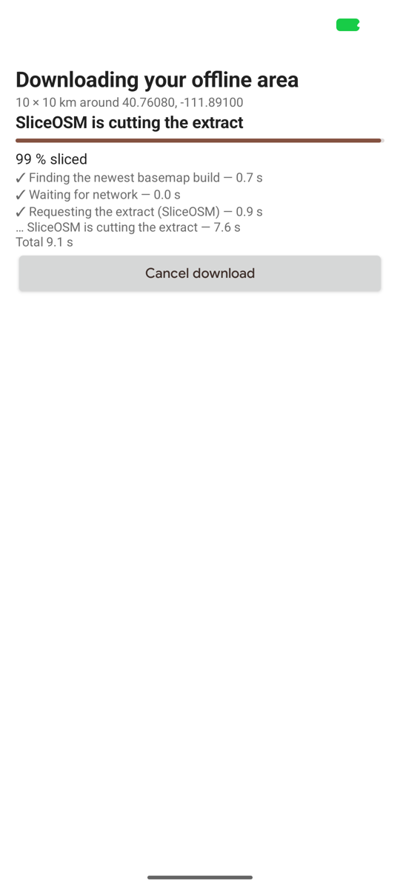
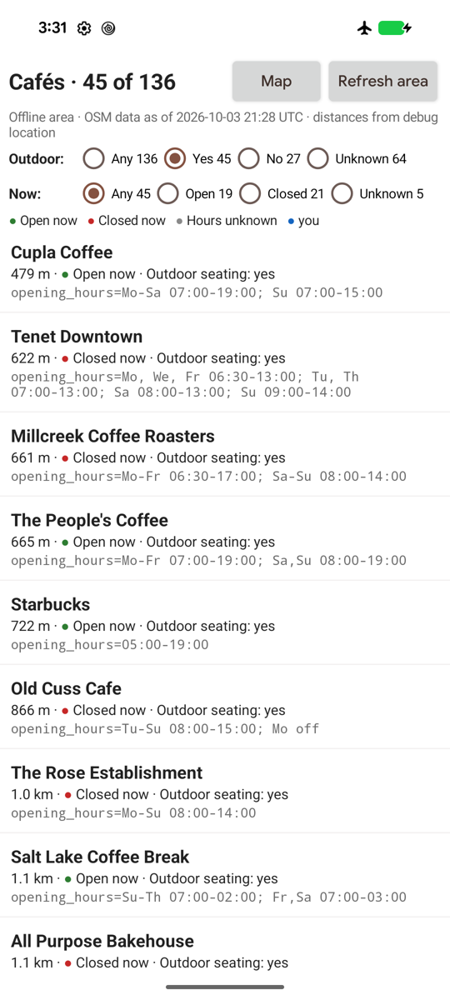
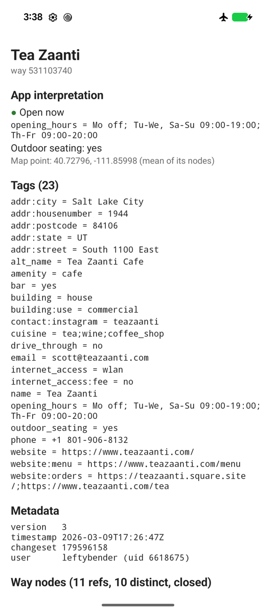

# Café app walkthrough

[`android/cafe-app`](../../android/cafe-app) is the reference app for
Cantino 0.1.0: find cafés near you, with no network after the first
download. Plain Android views, MapLibre Native 13.6.1, no Play Services.
It passed this acceptance scenario on a Pixel 8 (2026-10-03, downtown Salt
Lake City):

| Download | Map, airplane mode | Filters | Object detail |
| --- | --- | --- | --- |
|  |  |  |  |

Paths below are relative to `android/cafe-app/src/main/java/io/github/mvexel/cantino/cafe/`.

## 1. Download the area

| What | Code | Cantino API |
| --- | --- | --- |
| Location permission, one fix (`LocationManager`, 30 s timeout); fallback: type "lat,lon" or pick a preset | `MainActivity.startFirstRun`, `Location.kt` (`DeviceLocation.current`) | |
| 10×10 km box around the fix | `Cafes.kt`: `Geo.squareAround`, `Geo.AREA_SIZE_KM` (a default, not a cap) | `Bbox` |
| Offer dialog with the privacy line (the bbox goes to SliceOSM and the tile host) | `MainActivity.offerDownload` | |
| Find a basemap build (demo) and start the download | `MainActivity.startDownload` | `ProtomapsBuilds.latestUrl()`, `AreaManager.download(…, BasemapSource.Extract(planet, maxZoom = 15))` |
| Progress screen: phase, bytes (with total when known), per-phase durations | `MainActivity.ProgressScreen.update` | `AreaManager.state(areaId)`, every `AreaState` subtype |
| Failure: Retry, or back to the map (the previous area is kept) | `MainActivity.showFailure` | `AreaState.Failed.retryable`, `publishedArea` |
| Refresh: same bbox, full replace | `MainActivity.confirmRefresh` | `AreaMetadata.bbox`, `download` again |

The state is collected for the activity's whole life (`MainActivity.onCreate`),
so a relaunch during a download shows its progress, and the first emitted
state decides the screen: running → progress, published → map, otherwise →
first run.

Measured: Ready in 27.4 s, 75.6 MB database, 6.5 MB basemap
([Performance](performance.md#area-download-1010-km)).

## 2. Restart in airplane mode

Nothing to do in code: on launch, `publishedArea(AREA_ID)` is not null, so
`MainActivity` goes straight to `showMap()`. Every byte the map and queries
need is in `filesDir/cantino-areas/`.

## 3. Show the basemap

| What | Code | Cantino API |
| --- | --- | --- |
| Offline Protomaps style (copied from the sample app's `build-assets` by the `copyBasemapStyleAssets` Gradle task) with the area's PMTiles URL substituted | `MapScreen.styleJson` | `AreaInfo.pmtilesUrl` |
| Keep the camera over the area | `MapScreen.setupMap` | `AreaMetadata.bbox` |

## 4. Find nearby cafés

| What | Code | Cantino API |
| --- | --- | --- |
| One store, one thread, reopened after a refresh | `StoreWorker.withStore` | `OsmStore.open`, `AreaMetadata.workId` |
| All `amenity=cafe` in the area, paged by 500 | `CafeLoader.load` | `Query(tags, bbox, after, limit)`, `TagFilter.Equals` |
| A map point for ways and relations (mean of their resolvable nodes; an app choice, not exact geometry) | `CafeLoader.representativePoint` | `OsmObject.Way.nodeIds`, `Relation.members`, `store.get` |
| Dots on the map (GeoJSON source), nearby list sorted by distance | `MapScreen.applyFilters`, `MapScreen.geoJson` | |

Result on the Salt Lake City area: 136 cafés (120 nodes, 16 ways).

## 5. Filter by outdoor seating and opening hours

Interpretation lives in the app, never in Cantino:

| Filter | Code | Rule |
| --- | --- | --- |
| Outdoor seating Yes / No / Unknown | `Cafes.kt`: `OutdoorSeating.of` | `yes`, `no`, seating kinds (`sidewalk`, `garden`, …) = yes; missing or anything else = Unknown (raw value kept) |
| Open now / Closed / Unknown | `OpeningHours.kt` (14 JVM tests in `src/test`) | A strict subset of the `opening_hours` syntax; anything else is Unknown with a reason. Missing tag = Unknown |

Each choice shows its count, and Unknown is never folded into Open or Closed:
on this area 104 of 106 present `opening_hours` values evaluate; 30 cafés have
none.

## 6. Inspect tags and underlying objects

| What | Code | Cantino API |
| --- | --- | --- |
| Any object by kind and ID | `DetailActivity` | `store.get(OsmId)` |
| All raw tags | `DetailActivity.render` | `OsmObject.tags` |
| Metadata, or "not stored (location version N)" for untagged nodes | `DetailActivity.describe` | `ObjectMetadata`, `Node.locationVersion` |
| Way node list in order, repeats included, tap → node | `DetailActivity` | `Way.nodeIds` |
| Relation members (role, kind, id), "not in this area" when missing | `DetailActivity` | `Relation.members`, `get` returning null |

## Running it

```sh
scripts/basemap-assets.sh                         # style, glyphs, sprites
scripts/build-android.sh
cd android && mise exec -- ./gradlew :cafe-app:installDebug
# Automated runs: never send a real location; use the debug override (debuggable builds only)
adb shell am start -S -n io.github.mvexel.cantino.cafe/.MainActivity --ef lat 40.7608 --ef lon -111.8910
```

Known limits: opening hours use the device's time zone, not the café's;
the relation-café path has not run on a device (no café relation in the test
area).
