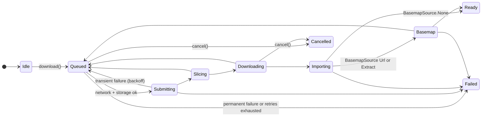

# Downloading areas

`AreaManager` downloads, refreshes and locates areas. Downloads run in
WorkManager, so they survive the app leaving the screen and process death,
wait for a network connection, and retry transient failures.

```kotlin
val areas = AreaManager(context)                       // cheap; create where you need it
val runId = areas.download(
    areaId = "city",
    bbox = Bbox(west = -111.95, south = 40.716, east = -111.832, north = 40.806),
    name = "Salt Lake City",                           // shown in SliceOSM's job list
    basemap = BasemapSource.Extract(planetUrl),        // optional; see Basemaps
)
areas.state("city").collect { state -> render(state) } // Flow<AreaState>, never completes
areas.cancel("city")                                   // keeps the published area
```

| Method | Thread | Notes |
| --- | --- | --- |
| `download(areaId, bbox, name, basemap)` | any | Replaces a running download of the same ID. Returns the WorkManager run ID |
| `cancel(areaId)` | any | No-op if nothing runs |
| `state(areaId)` | any (collect in a coroutine) | Current state first, then every change |
| `publishedArea(areaId)`, `dataFile`, `basemapFile` | **background** | Read the disk; may wait a few ms for a commit in progress |

## The state machine



Every state except `Idle` also has `runId: UUID` (first constructor property, not listed below).

| State | Payload | Meaning |
| --- | --- | --- |
| `Idle(published)` | published `AreaInfo?` | No download known (never started, or WorkManager pruned it after ~1 day). `runId` is null |
| `Queued(previousRuns)` | runs so far | Waiting for network/storage, or backing off after a transient failure |
| `Submitting` | | Sending the bbox to SliceOSM, or re-attaching to the job of an interrupted run |
| `Slicing(fraction)` | 0..1 or null | SliceOSM cuts the extract (null until the server reports totals) |
| `Downloading(bytes, totalBytes)` | | The PBF extract |
| `Importing` | | Building the SQLite file in staging (not interruptible; a cancel is honored when it returns) |
| `Basemap(phase, bytes, totalBytes)` | `DOWNLOAD` / `DIRECTORIES` / `TILES` | Only with a `BasemapSource` |
| `Ready(area)` | the published `AreaInfo` | Data and basemap published together |
| `Failed(message, retryable, reason)` | `FailureReason` | Nothing published. `reason` = why (see [Failures](#failures-and-retries)); `retryable` = transient cause that exhausted retries |
| `Cancelled` | | Nothing published |

Every state carries the same guarantee: **the previously published area is
intact until `Ready`**. You can keep showing it during a refresh and after a
failure.

`AreaState` is sealed, so `when (state) { … }` is exhaustive:

```kotlin
fun render(state: AreaState) = when (state) {
    is AreaState.Idle -> show(state.published)
    is AreaState.Queued -> status("Waiting for network…")
    is AreaState.Submitting -> status("Requesting extract…")
    is AreaState.Slicing -> status("Cutting extract ${state.fraction?.let { "${(it * 100).toInt()} %" } ?: ""}")
    is AreaState.Downloading -> status("Downloading ${state.bytes / 1_000_000} MB")
    is AreaState.Importing -> status("Preparing offline data…")
    is AreaState.Basemap -> status("Basemap: ${state.phase}")
    is AreaState.Ready -> show(state.area)
    is AreaState.Failed -> error(state.reason, state.message, canRetry = state.retryable)
    is AreaState.Cancelled -> status("Cancelled")
}
```

**`state()` follows the area, not one run.** Right after `download()` the
flow can still show the final state of an earlier run (WorkManager enqueues
asynchronously). Every state except `Idle` therefore carries `runId`, the
WorkManager ID of the run it belongs to: the `UUID` `download()` returned.
`isTerminal` is true for `Ready`, `Failed` and `Cancelled`. Match `runId` to
wait for *your* download (the [quickstart](../../README.md#quickstart) does the same):

```kotlin
val runId = areas.download("home", bbox)
val end = areas.state("home").first { it.runId == runId && it.isTerminal }
```

Plain `state(areaId)` collection (a progress UI) needs no matching: it shows
whatever run the area is on, and `runId` changes when a new run starts.

The blocking disk reads `dataFile`, `basemapFile` and `publishedArea` have
main-safe suspend counterparts: `loadDataFile`, `loadBasemapFile` and
`loadPublishedArea` (they run on `Dispatchers.IO`).

## Cancellation

`cancel(areaId)` stops a queued or running download; the state becomes
`Cancelled` shortly after. It is honored up to the commit point, including
during the import (whose staged result is then discarded). A cancel that
arrives during the final milliseconds of renames is ignored: that run reports
`Ready`. A new `download()` of the same ID cancels and replaces the running one.

## Failures and retries

| Cause | What happens | `Failed.reason` |
| --- | --- | --- |
| Network error, timeout, truncated download | Retried inline (3×, 1 s doubling), then the run ends and WorkManager reruns it with exponential backoff (from 30 s), up to 5 runs. A rerun resumes polling the same SliceOSM job instead of resubmitting. Retries exhausted: `Failed(retryable = true)` | `NETWORK` |
| HTTP 5xx / 408 / 429, a vanished SliceOSM job, an unparseable server answer, a job still slicing after `maxSliceWaitMillis` | As above (transient) | `SERVER` |
| A basemap server ignoring `Range` (or sending the wrong range) | `Failed(retryable = false)` at once | `SERVER` |
| Other HTTP 4xx (a `400` from SliceOSM on submit, a basemap URL that is `404`), invalid bbox or name, zooms the basemap archive lacks | `Failed(retryable = false)` at once | `INVALID_REQUEST` |
| A PBF that fails to import (corrupt, truncated, unsorted), a basemap that is not a valid PMTiles v3 archive | `Failed(retryable = false)` at once | `INVALID_DATA` |
| Disk full while downloading or importing | `Failed(retryable = false)` at once: free space, then `download()` again | `STORAGE` |
| An I/O error while publishing | Transient: the next run finishes the commit | `STORAGE` |
| An unexpected error (a bug), or a failure recorded by Cantino 0.1 | `Failed(retryable = false)` | `UNKNOWN` |
| Storage low before the run | Not a failure: the work stays `Queued` until storage recovers (WorkManager constraint) | |
| Process killed | WorkManager reruns the work; a run killed after its commit point is completed on the next access | |

Branch on `reason` for what to tell the user; `message` is a developer-facing
description (not localized, not for parsing):

```kotlin
is AreaState.Failed -> when (state.reason) {
    FailureReason.NETWORK -> "No connection. Try again later."
    FailureReason.STORAGE -> "Not enough space for the offline area."
    FailureReason.INVALID_REQUEST -> "This area cannot be downloaded."   // e.g. too large for SliceOSM
    FailureReason.SERVER, FailureReason.INVALID_DATA, FailureReason.UNKNOWN -> "Download failed. Try again later."
}
```

All of these knobs are in `AreaConfig` (`inlineRetries`, `maxRunAttempts`,
`backoffDelayMillis`, timeouts, `sliceBaseUrl`). Most apps pass
`AreaConfig()` or only set `foreground`. Downloads restart from byte 0 on a
retry (no byte-range resume in 0.1.0).

## Foreground mode

WorkManager stops an ordinary background run after about 10 minutes. A
10×10 km city area takes well under a minute, so most apps never need this.
For large areas, opt in:

```kotlin
val areas = AreaManager(
    context,
    AreaConfig(foreground = ForegroundConfig(title = "Downloading offline map", smallIcon = R.drawable.ic_download)),
)
```

and add to **your app's** `AndroidManifest.xml`:

```xml
<manifest xmlns:android="http://schemas.android.com/apk/res/android"
    xmlns:tools="http://schemas.android.com/tools">
    <uses-permission android:name="android.permission.FOREGROUND_SERVICE" />
    <uses-permission android:name="android.permission.FOREGROUND_SERVICE_DATA_SYNC" />
    <application>
        <service
            android:name="androidx.work.impl.foreground.SystemForegroundService"
            android:foregroundServiceType="dataSync"
            tools:node="merge" />
    </application>
</manifest>
```

The library does not declare these itself, because a `dataSync` foreground
service makes Google Play ask for a declaration in the Play Console, and apps
that never use the mode should not carry it.

| Situation | Behavior |
| --- | --- |
| Manifest entries missing | Logs a warning (tag `AreaDownloadWorker`) and runs as background work. Never crashes |
| `POST_NOTIFICATIONS` denied (Android 13+) | Runs in the foreground; the notification is not shown in the shade |
| Started from the background (Android 12+), e.g. a retry after backoff | Android refuses the foreground start; the run continues as background work |
| Android 15+ | `dataSync` services are limited to ~6 h per day |

The notification shows progress and a cancel action (`ForegroundConfig.cancelLabel`).

## Area size

The bbox is entirely your choice; there is no hard cap. Reference numbers for
a 10×10 km box around downtown Salt Lake City (Pixel 8, live services,
2026-10-03):

| Step | Time | Size |
| --- | --- | --- |
| Basemap build lookup (`ProtomapsBuilds.latestUrl`) | 0.7 s | |
| Submit + slicing (SliceOSM) | 0.9 s + 19.5 s | |
| PBF download | 0.8 s | 7.8 MB |
| Import | 3.2 s | 75.6 MB SQLite (778k nodes, 123k ways, 931 relations) |
| Basemap extract z0–15 | 0.9 s directories + 1.4 s tiles | 7.6 MB transferred, 6.5 MB PMTiles, 196 tiles |
| **Total to `Ready`** | **27.4 s** | **~82 MB on disk** |

A refresh of the same area took 14.0 s. Slicing time depends on SliceOSM's
load. More numbers: [Performance and sizes](performance.md).

## Privacy

A download sends the **bbox** to SliceOSM (`slice.openstreetmap.us`, run by
OpenStreetMap US) and, with a basemap, the byte ranges for that bbox to the
basemap host. If the bbox is centred on the user, it reveals their
approximate location to those services. Tell users before the first download
(the café app shows a one-line note). After that, nothing leaves the device:
queries and map rendering are local. Set `AreaConfig.sliceBaseUrl` if you run
your own SliceOSM instance.

## Manifest and permissions

| Entry | From | Why |
| --- | --- | --- |
| `INTERNET`, `ACCESS_NETWORK_STATE` | Cantino | Downloads; waiting for a network |
| `WAKE_LOCK`, `RECEIVE_BOOT_COMPLETED`, `FOREGROUND_SERVICE` | WorkManager | Scheduling (no service type, so no Play declaration) |
| Foreground-service `dataSync` entries | **your app**, opt-in | Foreground mode only |

An app that only reads an area it ships or imports itself can remove
`INTERNET` with `tools:node="remove"` (keep `ACCESS_NETWORK_STATE` if you use
MapLibre, which crashes without it; see
[`android/sample-app`](../../android/sample-app/src/main/AndroidManifest.xml)).

## Your own extracts

`OsmStore.importArea(input, destination)` imports any OSM PBF or OSM XML file
(no history files, no osmChange) into an area database, atomically. Call it
off the main thread; it takes seconds for a city. Use it when you obtain
extracts yourself, then `OsmStore.open(destination)`.
