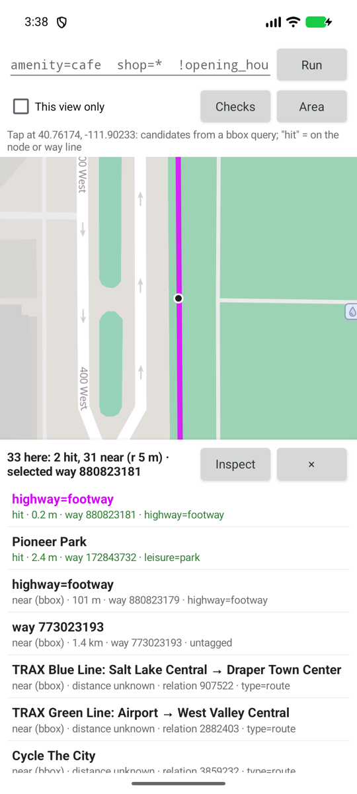
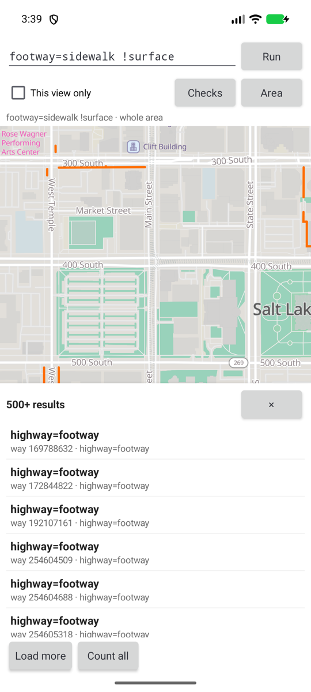
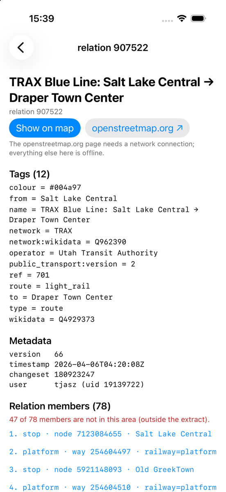
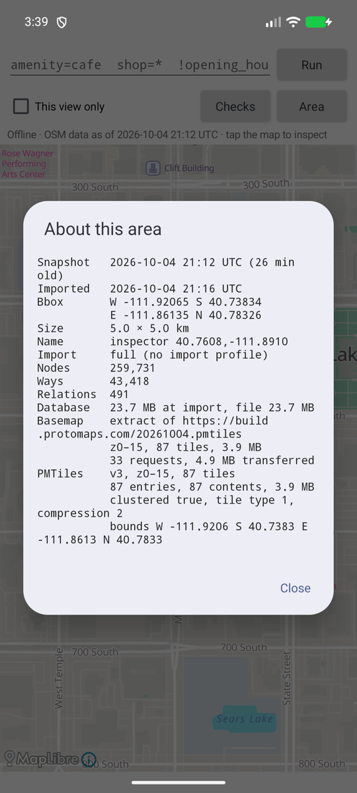
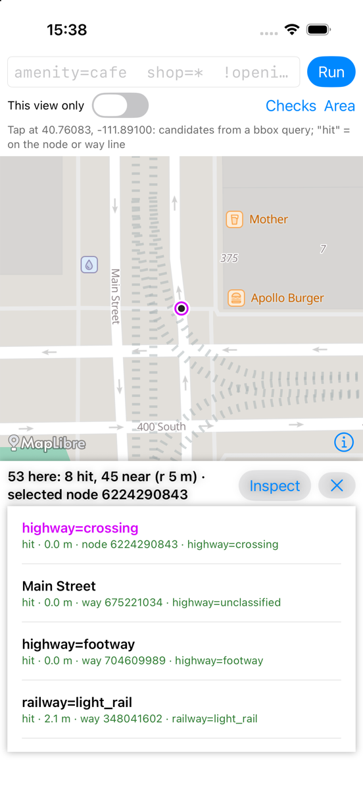
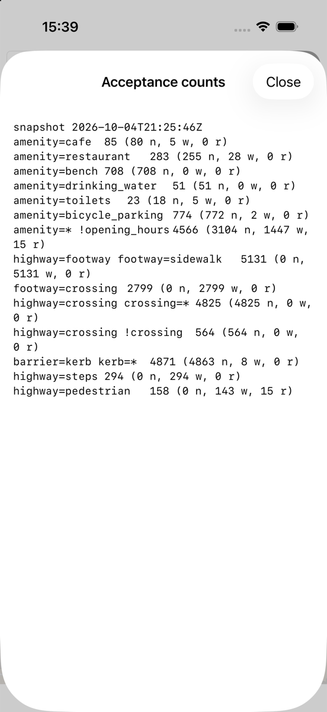
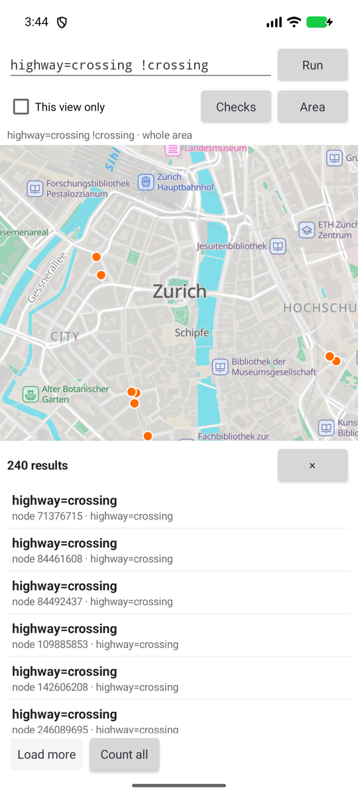
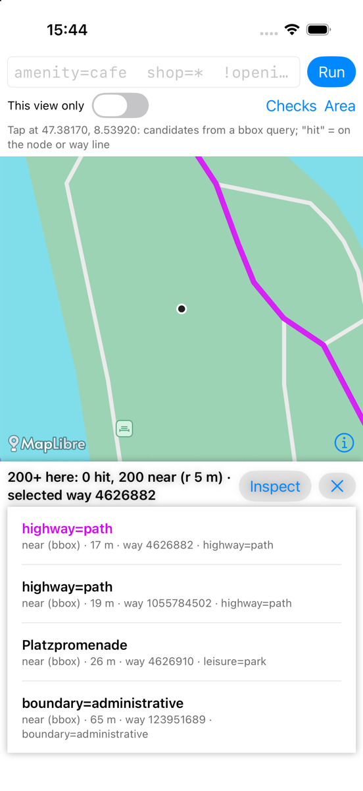

# Inspector walkthrough

Inspector is the example for OSM developers and mappers: it shows what is in
the OpenStreetMap data under your feet, with no network. Ask "every `amenity`
without `opening_hours`" or "every `highway=crossing` without `crossing`",
tap anywhere to see which objects are there, and follow a way to its nodes,
a relation to its members or a node to the ways that use it. Generic app
developers start with the [café app](cafe-app.md) instead; Inspector reuses
its plumbing and does not repeat its lifecycle walkthrough.

[`android/inspector-app`](../../android/inspector-app) (plain Android views,
MapLibre Native 13.6.1) and [`ios/inspector-app`](../../ios/inspector-app)
(SwiftUI, MapLibre Native 6.31.0, iOS 17+) are the same app, feature for
feature. It needs no SDK API beyond what the café app uses: `AreaManager`,
`query`, batch `get`, `wayCoordinates` and `PmtilesInfo`. Proposal and
decisions: [research note](../research/2026-10-04-second-demo-app-proposal.md).

| Tap: mid-sidewalk | Check: sidewalks without surface | Relation members | About this area |
| --- | --- | --- | --- |
|  |  |  |  |

Paths below are relative to `android/inspector-app/src/main/java/lol/osm/cantino/inspector/`;
each iOS file in `ios/inspector-app/InspectorApp/` has the same name with `.swift`
(Android activities map to `AppModel`, `MapScreen` and `ObjectView`).

## 1. Download the area

| What | Code | Cantino API |
| --- | --- | --- |
| Location, typed `lat,lon`, or the Salt Lake City / Zürich presets; debug override for automated runs | `MainActivity`, `Location.kt` (copied from the café app) | |
| 5×5 km box, a **full import** (no import profile: a filtered area would hide what Inspector exists to show) | `Geo.AREA_SIZE_KM`, `MainActivity.startDownload` | `Bbox.around`, `AreaManager.download(…, BasemapSource.Extract(planet, maxZoom = 15))` |
| One progress line (the café app shows the detailed screen) | `MainActivity.ProgressLine` | `AreaState` |
| Refresh (same bbox) and "Download another area" (full replace; one area per app) | `MapScreen.showAreaMenu` | `AreaMetadata.bbox` |
| Store holder, reopened after a refresh | `InspectorStore` (copied from `CafeStore`) | `AsyncOsmStore`, `AreaMetadata.workId` |
| Basemap build lookup | `ProtomapsBuilds` (copied unchanged) | |

## 2. Query bar and checks

| What | Code | Cantino API |
| --- | --- | --- |
| `k=v`, `k=*`, `!k`, `k="value with spaces"`; terms ANDed; exact and case-sensitive | `QueryBar.parse` (8 tests) | `TagFilter.Equals` / `Exists` / `NotExists` |
| "This view only": the visible map bbox | `MapScreen.runQuery` | `Query.bbox` (ways and relations are candidates) |
| Pages of 500, "Load more" | `Queries.page`, `MapScreen.loadPage` | keyset `Query.after` |
| "Count all" per kind, pages of 10 000, no geometry | `Queries.count` | |
| Results drawn: nodes as dots, ways as lines broken at missing vertices; relations listed only | `Inspect.shapes` | `wayCoordinates` (one call per way) |
| Checks menu: amenities without `opening_hours`, crossings without `crossing`, sidewalks without `surface`, kerbs without `kerb`, steps without `handrail`, benches without `backrest` | `Checks.ALL` | |
| Errors verbatim: the parser's message, or Cantino's category and message (a lone `!key` without "this view only" is Cantino's `InvalidArgument`; so is a view with more than 100 000 candidates) | `MapScreen.verbatim` | `CantinoException` / `CantinoError` |

## 3. Tap to inspect

Cantino has no "what is here" query, so the app builds one:

| Step | Code | Cantino API |
| --- | --- | --- |
| A box of about 20 dp around the finger (3–60 m), one bbox query without tag filters, at most 200 candidates | `Inspect.tap` | `Query(bbox, limit)` |
| Tagged node: **hit** within the radius | `HitTest.node` | |
| Way: distance to its nearest segment; **hit** within the radius. Untagged vertices are never returned by a bbox query, so the middle of a sidewalk finds the way through its line | `HitTest.way`, `Geo.distanceToLineMeters` | `wayCoordinates` |
| Relation, or a large way tapped inside (a park): **near (bbox)**. There is no point-in-polygon test | `HitTest.relation` | |
| Order: hits, then near; nearest first; then node, way, relation and ID | `HitTest.ORDER` (7 geometry tests) | |
| Selecting a row highlights its geometry, broken where vertices are outside the area | `Inspect.shape`, `Geo.segments` | null entries of `wayCoordinates` |

## 4. Object navigator

| What | Code | Cantino API |
| --- | --- | --- |
| Tags, metadata (or "not stored" and the location version for untagged nodes) | `ObjectActivity.render` | `OsmObject.tags`, `ObjectMetadata`, `Node.locationVersion` |
| Way nodes in order, repeats kept, tagged vertices marked, each a link | `Inspect.detail` | batch `get` |
| Relation members with roles, each a link | `Inspect.detail` | batch `get` |
| Missing references: "47 of 78 members are not in this area" | `ObjectDetail.missingReferences` | `get` returns null |
| Ways using this node, best effort: ways whose bbox contains the node and whose node list has it (complete for ways in the extract; there is no node→way index) | `Inspect.parentWays` | bbox `Query` |
| "Show on map" (back to the map, highlighted, camera fitted) | `MainActivity.onNewIntent`, `MapScreen.select` | |
| openstreetmap.org link, marked as needing the network | `Labels.osmOrgUrl` | |

## 5. About this area

Snapshot time and age, import time, bbox and size, the import profile (none),
node/way/relation counts and database size from the import report, the
basemap download facts from `AreaMetadata.basemap`, and the basemap file
itself read with `PmtilesInfo.read` (spec version, zooms, tiles, entries,
bounds). Code: `About.kt` / `About.swift`.

## Tests

The same names on both platforms ([parity](platform-parity.md#inspector)):

| Android | iOS | Covers |
| --- | --- | --- |
| `QueryBarTest` (8, JVM) | `QueryBarTests` | syntax, quoting, errors, round trip, every preset parses |
| `GeometryTest` (7, JVM) | `GeometryTests` | segment distance, gaps, runs, hit/near, ordering, labels |
| `InspectTest` (7, instrumented) | `InspectTests` | on a real store imported from one shared fixture ([`inspector.osm`](../../android/inspector-app/src/androidTest/assets/inspector.osm)): taps on a crossing, mid-sidewalk and inside a park; ways using a node; missing references and broken geometry; check counts and the lone-`!key` error; paging |

## Acceptance, 2026-10-04

Android on the Pixel 8 emulator (Android 17, arm64), iOS on the iPhone 17 Pro
simulator (iOS 26.2). Each area was downloaded live on both platforms at the
same time, then queried after a cold launch. The two platforms imported the
**same snapshot into byte-identical databases** (SHA-256 of the `.sqlite`
files equal), so every count must match; they do.

| Area (5×5 km) | Snapshot | Nodes / ways / relations | Database | Basemap |
| --- | --- | --- | --- | --- |
| Salt Lake City, centre 40.7608, -111.8910 | 2026-10-04 21:12:59Z (Android), 21:25:46Z (iOS); same data | 259,731 / 43,418 / 491 | 23.7 MB | 3.9 MB, 87 tiles |
| Zürich, centre 47.3744, 8.5410 | 2026-10-04 21:38:41Z (both) | 424,575 / 69,701 / 1,766 | 45.3 MB | 5.6 MB, 85 tiles |

Counts over the whole area (the debug `counts` option logs and shows them):

| Query | SLC Android | SLC iOS | Zürich Android | Zürich iOS |
| --- | --- | --- | --- | --- |
| `amenity=cafe` | 85 | 85 | 301 | 301 |
| `amenity=restaurant` | 283 | 283 | 840 | 840 |
| `amenity=bench` | 708 | 708 | 3,945 | 3,945 |
| `amenity=drinking_water` | 51 | 51 | 477 | 477 |
| `amenity=toilets` | 23 | 23 | 196 | 196 |
| `amenity=bicycle_parking` | 774 | 774 | 1,395 | 1,395 |
| `amenity=* !opening_hours` | 4,566 | 4,566 | 17,734 | 17,734 |
| `highway=footway footway=sidewalk` | 5,131 | 5,131 | 5,568 | 5,568 |
| `footway=crossing` | 2,799 | 2,799 | 3,869 | 3,869 |
| `highway=crossing crossing=*` | 4,825 | 4,825 | 3,849 | 3,849 |
| `highway=crossing !crossing` | 564 | 564 | 240 | 240 |
| `barrier=kerb kerb=*` | 4,871 | 4,871 | 3,965 | 3,965 |
| `highway=steps` | 294 | 294 | 2,076 | 2,076 |
| `highway=pedestrian` | 158 | 158 | 354 | 354 |

Taps (debug `tap`, radius 5 m), first candidates, identical on both platforms
including distances:

| Tap | SLC | Zürich |
| --- | --- | --- |
| On a crossing node | 40.7608264, -111.8909985: hit node 6224290843 `highway=crossing` 0 m, hit way 675221034 (Main Street) 0 m, hit way 704609989 `highway=footway` 0 m | 47.3744835, 8.5387790: hit node 663075859 `highway=crossing` 0 m, hit way 332455374 (Bahnhofstrasse) 0 m, hit way 1050875571 `highway=footway` 0 m |
| On a sidewalk | 40.76200, -111.90230: hit way 880823181 (`footway=sidewalk`) 2.5 m | 47.37447, 8.53890: hit way 1051685528 (`footway=sidewalk`) 2.3 m |
| Inside a large park | 40.76150, -111.90110 (Pioneer Park): no hit; near way 172843732 `leisure=park` 78 m | 47.38170, 8.53920: no hit; near way 4626910 `leisure=park` 26 m |
| Mid-sidewalk, no vertex near | 40.76174, -111.90233: hit way 880823181 0.17 m (its vertices are 100 m away) | 47.37445, 8.53895: hit way 1051685528 0.14 m |

Offline: the emulator and simulator are shared with other runs, so neither
was put in airplane mode. As for the [iOS café app](cafe-app.md#ios), after
the downloads a cold launch that ran a query, a tap with selection and all
counts left the app with no internet sockets: `lsof -a -i -p <pid>` empty on
iOS, and no `/proc/net/{tcp,tcp6,udp,udp6}` entry owned by the app's UID on
Android. The style references only `asset://` and the area's
`pmtiles://file://` archive.

| SLC, iOS: tap on a crossing | SLC, iOS: counts | Zürich, Android: crossings without `crossing` | Zürich, iOS: tap inside a park |
| --- | --- | --- | --- |
|  |  |  |  |

All screenshots: `docs/screenshots/2026-10-04-inspector-*.png`.

## Running it

```sh
scripts/basemap-assets.sh                       # style, glyphs, sprites (both platforms copy them at build time)
scripts/build-android.sh
cd android && mise exec -- ./gradlew :inspector-app:installDebug
# Debug builds only; never real GPS in automated runs. lat/lon is sticky (clear_debug_location).
adb shell am start -n lol.osm.cantino.inspector/.MainActivity --ef lat 40.7608 --ef lon -111.8910 --ez auto_download true
adb shell "am start -n lol.osm.cantino.inspector/.MainActivity --es query 'amenity=* !opening_hours' --ez view_only true"
adb shell am start -S -n lol.osm.cantino.inspector/.MainActivity --es tap 40.76174,-111.90233 --ef radius 5 --ei select 0
adb shell am start -S -n lol.osm.cantino.inspector/.MainActivity --es object relation/907522
adb shell am start -S -n lol.osm.cantino.inspector/.MainActivity --ez counts true   # logcat tag InspectorCounts
```

```sh
scripts/basemap-assets.sh && scripts/build-ios-inspector.sh install   # SIMULATOR=… or SIMULATOR_ID=<udid>
xcrun simctl launch booted lol.osm.cantino.inspector -lat 40.7608 -lon -111.8910 -auto_download YES
xcrun simctl launch booted lol.osm.cantino.inspector -query 'amenity=* !opening_hours' -view_only YES
xcrun simctl launch booted lol.osm.cantino.inspector -tap 40.76174,-111.90233 -radius 5 -select 0
xcrun simctl launch booted lol.osm.cantino.inspector -object relation/907522
xcrun simctl launch booted lol.osm.cantino.inspector -counts YES                    # os_log category InspectorCounts
```

Other options on both: `zoom`, `about`. Tests: `./gradlew
:inspector-app:testDebugUnitTest :inspector-app:connectedDebugAndroidTest`
and `scripts/build-ios-inspector.sh test`.

## Known limits

- A page of results is drawn as it loads; ways cost one `wayCoordinates`
  call each, so a page of 500 ways takes a moment. There is no "draw
  everything" layer and no name search (later, after measuring).
- Relations are never hit-tested and never drawn as results; a selected
  relation highlights at most 300 member ways.
- "Ways using this node" knows only the ways in the extract.
- "This view only" uses the whole map view, including the part under the
  results panel.
